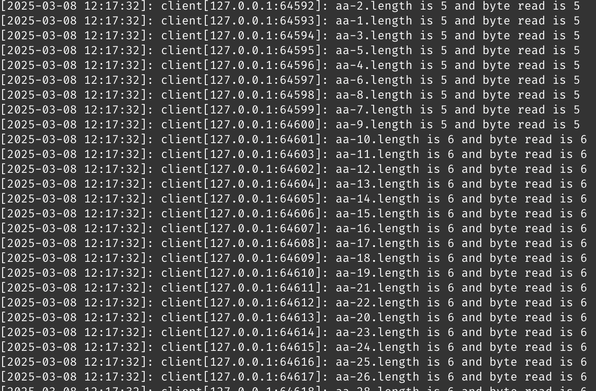
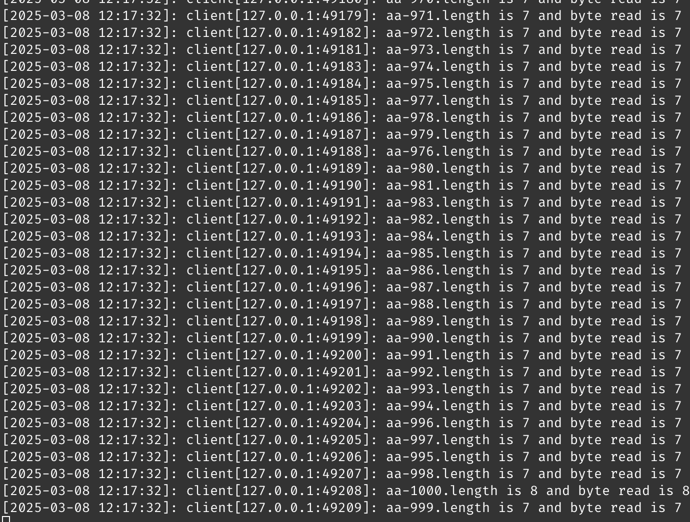

# Preface
刚开始学习 Linux 网络编程的时候，你会发现，如何处理大量连接是非常重要的。从 `fork` 子进程开始、到 `select`, `poll`，轮询出来，到最后真正开发服务器的时候，还是用性能最好的 `epoll`(**Linux**) 和 `kqueue`(**FreeBSD and Macos**)


## Kqueue
我自己的电脑是 Macos，是 FreeBSD 衍生来的，所以使用的是 **Kqueue** 机制。
网上的关于 **Kqueue** 介绍五花八门的，最后我是看的 FreeBSD 提供的 [PDF](https://people.freebsd.org/~jlemon/papers/kqueue.pdf) 理解和学会使用 **Kqueue** 的，这个 13 页的 PDF 对于 Kqueue 的概念和使用介绍的很详细，作为入门很不错的。

### 介绍
在 **Kqueue** 之前，网络编程都是使用 **select** 和 **poll** 机制，**select** 机制我了解学习过一段时间。
1. 同时最多处理 1024 个处理，这是内核限制的，如果要修改，只能自己编译内核，很不方便；
2. 应用程序每次调用时都必须传入要监视的整个描述符列表，但是大部分复制都是不活动的。
3. 并且每次处理请求都要依次遍历，每次都需要用户态，也就是操作者遍历这个列表(O(N)的时间复杂度)，寻找有变化的文件描述符号，**但是这个是内核已经知道的（因为设置文件描述符的状态）**，这样两者的操作就重复了。

###### kqueue-struct
```
struct kevent {
  uintptr_t       ident;  /* identifier for this event */
  int16_t         filter; /* filter for event */
  uint16_t        flags;  /* general flags */
  uint32_t        fflags; /* filter-specific flags */
  intptr_t        data;   /* filter-specific data */
  void            *udata; /* opaque user data identifier */
};
```
> The primary goal was to create a system that would be efficient and scal- able to a large number of descriptors, on the order of several thousand

> The secondary goal was to make the system flexible.

Kqueue 除了用于网络编程，还可以用于监听文件的操作。 [案例](#文件系统)

> Another goal was to keep the interface simple enough that it could be easily understood, and also possible to convert poll() or select() based applications to the new API with a minimum of changes. 


> Expanding the amount information returned to the ap- plication to more than just the fact that an event occurred was also considered desirable. For readable sockets, the user may want to know how many bytes are actually pending in the socket buffer in order to avoid multiple read() calls. For listening sockets, the application might check the size of the listen backlog in order to adapt to the offered load. The goal of providing more information was kept in mind when designing the new facility.

这个就比较有意思了，在网络编程中，肯定是同时要监听 server 和 client fd 的，
1. 对于 **server fd**，[kevent 结构体](#kqueue-struct)的 data 返回 **已完成队列** 里的 client 数量，接下来就是处理连接就好了。
2. 对于 **client fd**，[kevent 结构体](#kqueue-struct)的 data 返回 **可以对于的数据的 bytes 长度**。

> As an example, consider the case where several net- work packets arrive for a socket. We could consider each incoming packet as a discrete event, recording one event for each packet. However, the number of incoming pack- ets is essentially unbounded, while the amount of mem- ory in the system is finite; we would be unable to provide a guarantee that no events would be lost.

事件合并，对于同一个 socket，短时间内到了大量的数据，epoll 会将他们合并，这个时候就要在协议层处理数据边界了。

> Events will normally considered to be “level- triggered”, as opposed to “edge-triggered”. Another way of putting this is to say that an event is be reported as long as a specified condition holds, rather than when activity is actually detected from the event source. The given condition could be as simple as “there is unread data in the buffer”, or it could be more complex. This approach handles the scenario described above, and allows the ap- plication to perform a partial read on a buffer, yet still be notified of an event the next time it calls the API. This corresponds to the existing semantics provided by poll() and select().

在 github 上面有时间看到各种各样的网络框架，有时候会描述 **水平触发** 和 **边缘触发** 这两个，当时我还不清楚是啥意思呢。
1. 水平触发：socket 里面有数据就一直通知，以防某次数据没有读取完。 (**Kqueue 使用的是这个**)
2. 边缘触发：socket 里有新的事件就触发，里面是否有剩余数据不关心。

### 使用
Kqueue 的 API 比较简单。
1. **kqueue()** 创建一个 kqueue 文件描述符，返回 -1 表示创建失败
2. **kevent()** 用于添加事件或者返回已经触发的事件。
3. **EV_SET** 这是一个宏，快捷的设置 [kevent 结构体](#kqueue-struct) 对象。


#### EV_SET
这个比较简单，提供了一种比较快速的方式初始化 kevent 结构体，一读就理解了。
```c
#define EV_SET(kevp, a, b, c, d, e, f) do {     \
  struct kevent *__kevp__ = (kevp);       \
  __kevp__->ident = (a);                  \
  __kevp__->filter = (b);                 \
  __kevp__->flags = (c);                  \
  __kevp__->fflags = (d);                 \
  __kevp__->data = (e);                   \
  __kevp__->udata = (f);                  \
} while(0)
```

#### kqueue-func
返回一个 kqueue 文件描述符，返回 -1 表示失败。

#### kevent
对于注册监听和响应事件返回都是使用这个函数。注册监听和响应分开的好，分别调用 kevent 函数实现。
```c
int kevent(int kq,
    const struct kevent *changelist, int nchanges,
    struct kevent *eventlist, int nevents,
    const struct timespec *timeout);
```

##### 注册事件
像 [kevent 函数一样](#kqueue-func)，如果只是注册事件，那么 `struct kevent *eventlist` 设置为 **NULL**，**nevents** 设置为 0。
```c
int kq = kqueue();
if ((kq = kqueue()) == -1) {
  perror("kqueue create error");
  exit(EXIT_FAILURE);
}
// 
int listen_fd;
/*
listen_fd  socker server fd init.
*/
struct kevent evSet;
//
EV_SET(&evSet, listen_fd, EVFILT_READ, EV_ADD, 0, 0, 0);
if (kevent(kq, &evSet, 1, NULL, 0, NULL) == -1) {
  perror("kevent add server fd error");
  exit(EXIT_FAILURE);
}
```

##### 响应事件
和注册事件相反，`struct kevent *changelist` 设置为 **NULL**，**nchanges** 设置为 0，
`const struct timespec *timeout` 为 `NULL` 表示一直阻塞，知道事件的发生。
```c
struct kevent evList[1024];
int nev, fd;
nev = kevent(kq, NULL, 0, evList, 1024, NULL);
```


### 代码学习

#### 文件系统 

关于 Kqueue 文件系统的触发条件，可以参考 [FreeBSD 的官方文档](https://man.freebsd.org/cgi/man.cgi?kqueue) ，介绍的比较详细

其中注意的是

1. 像如下案例中，监听目录的话，目录下面的文件是不是监听的（这也很合理，不然一监听根目录 `/` 估计得崩），需要自己手动去添加
2. `NOTE_LINK` 只有在硬连接数量变化的时候才会触发。目录无法创建硬连接，但是当子目录创建或者删除的时候会触发，这个就涉及到了文件系统了，因为父目录中会包含对子目录的引用，即在父目录的目录项中会添加一个指向子目录的项。默认一个新目录硬连接数量为 2，分别是 `..` 和 `.`。 (新建一个目录, `ls -a` 就可以看见)，嵌套的不用说了。


```c
#include <sys/event.h>
#include <stdlib.h>
#include <errno.h>
#include <stdio.h>
#include <unistd.h>
#include <fcntl.h>

int main()
{
        printf("kqueue listen dir\n");
        int kq;
        if((kq = kqueue()) == -1){
                perror("create kqueue error");
                exit(EXIT_FAILURE);
        }
        printf("kqueue create kq successfully! %d\n", kq);
        int dir_fd;
        if((dir_fd = open("./listenDir", O_DIRECTORY)) == -1){
                perror("open directory error");
                exit(EXIT_FAILURE);
        }
        printf("dir fd is %d\n", dir_fd);
        struct kevent dk;
        EV_SET(&dk, dir_fd, EVFILT_VNODE, EV_ADD | EV_ENABLE | EV_CLEAR, NOTE_ATTRIB | NOTE_WRITE | NOT
E_LINK | NOTE_RENAME | NOTE_DELETE, 0, NULL);
        if(kevent(kq, &dk, 1, NULL, 0, NULL) == -1){
                perror("register event error");
                exit(EXIT_FAILURE);
        }
        printf("register event successfully!\n");
        struct kevent tk;
        int ret;
        struct timespec timeout = { 0, 900000000 }; // 设置 900 毫秒
        for(;;){
                printf("in loop\n");
                ret = kevent(kq, NULL, 0, &tk, 1, &timeout);
                printf("ret in loop %d, tk data is %ld\n", ret, tk.data);
                if(ret == -1){
                        perror("kevent response error");
                        exit(EXIT_FAILURE);
                }
                if(tk.filter != EVFILT_VNODE) continue;
                if(tk.flags & EV_ERROR){
                        perror("kevent ret error");
                        continue;
                }
                if(tk.fflags & NOTE_ATTRIB){
                        printf("file attribute modified\n");
                }
                if(tk.fflags & NOTE_WRITE){
                        printf("some file be writed\n");
                }
                if(tk.fflags & NOTE_DELETE){
                        printf("some file be deleted\n");
                }
                if(tk.fflags & NOTE_RENAME){
                        printf("some file be renamed\n");
                }
                if(tk.fflags & NOTE_LINK){
                        printf("some file be linked\n");
                }
        }
        close(dir_fd);
        close(kq);
        return 0;
}
```


#### 网络服务器
```c
#include <stdlib.h>
#include <stdio.h>
#include <sys/event.h>
#include <unistd.h>
#include <errno.h>
#include <sys/socket.h>
#include <netinet/in.h>
#include <strings.h>
#include <time.h>
#include <arpa/inet.h>

#define ClientL 1024

void eexit(char *str);
void print_ctime();

int main()
{
  printf("kqueue multi io server start\n");
  int kq;
  printf("create kqueue start\n");
  if((kq = kqueue()) == -1){
    eexit("create kqueue error");
  }
  printf("create socket start\n");
  int listen_fd, client_fd;
  if((listen_fd = socket(AF_INET, SOCK_STREAM, 0)) < 0){
    eexit("create socket fd error");
  }
  struct sockaddr_in server_addr;
  server_addr.sin_family = AF_INET;
  server_addr.sin_port = htons(9000);
  server_addr.sin_addr.s_addr = htonl(INADDR_ANY);
  printf("bind start\n");
  if(bind(listen_fd, (struct sockaddr *)&server_addr, sizeof(server_addr)) < 0){
    eexit("bind port error");
  }
  printf("bind successful\n");
  if(listen(listen_fd, 10) < 0){
    eexit("listen error");
  }
  printf("listen successfully\n");
  struct kevent sk;
  EV_SET(&sk, listen_fd, EVFILT_READ, EV_ADD, 0, 0, NULL);
  if(kevent(kq, &sk, 1, NULL, 0, NULL) < 0){
    eexit("register error");
  }
  struct kevent ck[ClientL];
  int ret;
  socklen_t client_len;
  printf("开始 kqueue 事件循环\n");
  for(;;){
    ret = kevent(kq, NULL, 0, ck, 32, NULL); // todo timeout
    if(ret == -1){
      eexit("kevent response error");
    }
    for(int i=0;i<ret;i++){
      struct kevent item = ck[i];
      if(item.flags & EV_EOF){
        // printf("conn occur EOF\n");
        if(item.ident == listen_fd){
          eexit("server closed!!!!!!!!!!");
        }
        EV_SET(&sk, item.ident, EVFILT_READ, EV_DELETE, 0, 0, NULL);
        if(kevent(kq, &sk, 1, NULL, 0, NULL) < 0){
          eexit("Delete client fd error");
        }
        close(item.ident);
        free(item.udata);
        // printf("conn closed success\n");
      }else{
        if((item.ident == listen_fd) && (item.flags & EVFILT_READ)){
          // 分配 udata 结构体
          struct sockaddr_in *client_addr = malloc(sizeof(struct sockaddr_in));
          if (!client_addr) {
              eexit("malloc failed");
          }
          memset(client_addr, 0, sizeof(struct sockaddr_in));
          client_len = sizeof(*client_addr);
          if((client_fd = accept(listen_fd, (struct sockaddr *)client_addr, &client_len)) < 0){
            eexit("accept error");
          }
          EV_SET(&sk, client_fd, EVFILT_READ, EV_ADD, 0, 0, client_addr);
          if(kevent(kq, &sk, 1, NULL, 0, NULL) < 0){
            eexit("add client fd error");
          }
          // printf("client conn come\n");
        }else if(item.flags & EVFILT_READ){
          struct sockaddr_in *cs = (struct sockaddr_in *) item.udata;
          char buf[256];
          size_t bytes_read;
          bzero(buf, 256);
          bytes_read = recv(item.ident, buf, sizeof(buf), 0);
          print_ctime();
          char str[INET_ADDRSTRLEN];
          printf("client[%s:%d]: %slength is %ld and byte read is %ld\n", inet_ntop(AF_INET, &cs->sin_addr, str, sizeof(str)), ntohs(cs->sin_port),
           buf, item.data, bytes_read);
          send(item.ident, buf, sizeof(buf), 0);
        }
      }
    }
  }
  close(listen_fd);
  close(kq);
  return 0;
}
void eexit(char *str)
{
  perror(str);
  exit(EXIT_FAILURE);
}


void print_ctime(){
  time_t t;
  struct tm *tm_info;

  time(&t);  // 获取当前时间（时间戳）
  tm_info = localtime(&t);  // 转换为本地时间

  printf("[%02d-%02d-%02d %02d:%02d:%02d]: ",
          tm_info->tm_year + 1900,  // 年份是从 1900 开始的
          tm_info->tm_mon + 1,      // 月份是从 0 开始的
          tm_info->tm_mday,
          tm_info->tm_hour,
          tm_info->tm_min,
          tm_info->tm_sec);
}

```


编译运行服务器，其中 `ulimit -n 65535` 是为了打开更多的文件描述符号，为了测试使用，
```shell
ulimit -n 65535 && clang server.c -o server && ./server
```

client 就不提供了，随便写一个 Tcp client 就可以了，再编写一个测试脚本 `test.sh`
```shell
for i in {1..1000}; do
  echo "aa-${i}" | ./echo_client 127.0.0.1 &
done
```
打开 server 服务器在测试运行 bash 脚本






可以看到，并发处理的还是非常快的，当然，这个只是一个最简单的 Kqueue 并发服务器，想要用到生产实践中，还有很多很多的事情需要处理，我看过公司的 epoll 并发服务器，需要处理的细节还是非常多的。
