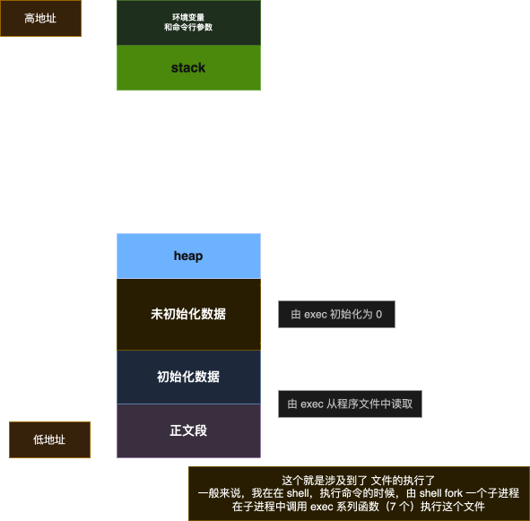
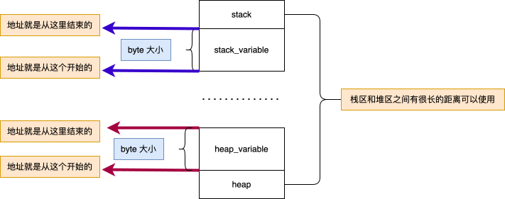

# Preface
这篇文章记录我对C程序内存结构以及内存对齐的一些学习记录过程，大学的时候，就在书籍上看过内存对齐，但是当时没有注意，此时在看 APUE 的我，又开始了记录。
## C程序的内存布局
在 Linux 系统中的，一个进程程序的基本布局如下



### 正文段
只读的字段，包含 CPU 执行的指令，是共享，fork 之后子进程也会继承。

### 初始化数据段
包含程序中已经显式初始化的变量，比如 `static int name = "vzgoll"` 或者在 **函数外** 的 `int age = 9999`;

### 未初始化的数据段
也叫 `bbs` 段 **block started by symbol**，这个段内的数据会被初始化为 0 或者 NULL 指针，比如在 **函数外** 的 `int age` 就会被存在 bbs 中，被初始化为 0，需要注意的是在函数外，在函数内那就是运行时的 stack 里了。

### 最高处的环境变量和命令行参数
关于 C 程序的环境变量的更改读取，由于他是在 stack 上面，是无法扩张的，更改和添加是比较有意思的，大家可以自己去看看 APUE 7.9 节。

### stack and heap 中变量的内存布局
栈区 stack，堆区 heap
由图我们可以看出来，stack 的地址是从高地址的向低地址增长的（这就是涉及到一个问题了，stack 里变量的地址是开始地址还是结束地址），heap 的地址由低到高增长的，用于动态分配内存的区域，stack 和 heap 之间可用空间还是很大的。 （**对于系统一些没有硬件支持的 stack，C 语言可能会使用链表使用 stack 栈区，这个时候就是不是从高地址到低地址**）
在前面说过，栈区 stack 的变量的地址是从高地址向低地址拓展，可以打印变量地址看看，同时有涉及到了一个问题，那就是是 `%p` 打印的是结束的地址还是开始的地址，如下的函数可尝试验证。
```c
void stack_variable()
{
  printf("stack variable address -----------------\n");
  // 栈变量测试
  unsigned int d = 2282819976;                            // 0b10001000000100010001000110001000
  unsigned short *after_tb_d = (unsigned short *)&d;      // unsigned short 无符号 2 字节，取后面两个字节
  unsigned short *before_tb_d = (unsigned short *)&d + 1; // unsigned short 无符号 2 字节，取前面两个字节
  printf("d的后面两位: %d, after_tb_d: %d\nd的前面两位 %d, before_tb_d: %d\n", 0b0001000110001000, *after_tb_d, 0b1000100000010001, *before_tb_d);
  printf("stack variable address -----------------\n");
}

void heap_variable_address()
{
  printf("heap variable address -----------------\n");
  // 栈变量测试
  unsigned int *hd = malloc(sizeof(unsigned int)); // 0b10001000000100010001000110001000
  *hd = 2282819976;
  unsigned short *after_tb_d = (unsigned short *)hd;      // unsigned short 无符号 2 字节，取后面两个字节
  unsigned short *before_tb_d = (unsigned short *)hd + 1; // unsigned short 无符号 2 字节，取前面两个字节
  printf("hd的后面两位: %d, after_tb_d: %d\nhd的前面两位 %d, before_tb_d: %d\n", 0b0001000110001000, *after_tb_d, 0b1000100000010001, *before_tb_d);
  printf("heap variable address -----------------\n");
  free(hd);
}
/*
  last environment list address is 0x16f097e12
  stack variable address -----------------
  d的后面两位: 4488, after_tb_d: 4488
  d的前面两位 34833, before_tb_d: 34833
  stack variable address -----------------
  heap variable address -----------------
  hd的后面两位: 4488, after_tb_d: 4488
  hd的前面两位 34833, before_tb_d: 34833
  heap variable address -----------------
*/
```
看上面的函数的可以知道，`返回的都是变量的开始地址，然后向上拓展变量需要的字节数量`，而 `stack 地址从高地址到低地址是指他变量分配的起始地址是从高到低，但是变量自身拓展还是向上`。也可以理解为叠盒子




### stack and heap 中内存的从高到低
要验证 stack 是高地址到低地址的话，不能直接使用定义变量，判断变量的地址变化，因为系统有时候会优化内存布局，**保证内存对齐导致那些后定义变量的地址反而在前面**。


#### 2025-06-11 补充
按照 `x84_64 abi 0.99`来说是架构有关，如 `x86_64` 架构上，在 `rsp` 区域下有 128 字节的 `red zone` 可以给 [`leaf function`](https://gcc.gnu.org/onlinedocs/gccint/Leaf-Functions.html)使用，我们上面的例子就是很经典的，如果使用了递归调用就不是 leaf function，就有了自己的 `stack frame` 形成了。


```c
void test_stack_de(int times)
{
  int a = 1;
  printf("a address: %p|", &a);
  if (times > 0)
  {
    test_stack_de(times - 1);
  }
  else
  {
    printf("\n");
  }
}
```
1. `Ubuntu`: 结果是 **a address: 0x7ffe34d6b064|a address: 0x7ffe34d6b034|a address: 0x7ffe34d6b004|a address: 0x7ffe34d6afd4|**
2. `FreeBSD`: 结果是 **a address: 0x803ef488|a address: 0x803ef468|a address: 0x803ef448|a address: 0x803ef428|**
3. `MacOS`: 结果是 **a address: 0x16d3e2a58|a address: 0x16d3e2a38|a address: 0x16d3e2a18|a address: 0x16d3e29f8|**

好了，这就能直观的看到 stack 的高地址到低地址了

原来在测试这个例子的时候，地址的差值是 48 bits，当时没有注意，今天在看 `x86_64 abi` 的时候，

> Although the AMD64 architecture uses 64-bit pointers, implementations are only required to handle 48-bit addresses. Therefore, conforming processes may only use addresses from 0x00000000 00000000 to 0x00007fff ffffffff17.

有说过了，虚拟地址空间只是用了 48 bit


### 基本类型的对齐
对于基本的数据类型，都要按照类型的基本长度对齐，不同的平台的是不一样，学习应用的时候要多多注意
这个其实不是很好理解学习。

**类型变量的地址必须是类型的整数倍，就比如，APUE malloc 函数那里提到过 double 地址必须为 8 的倍数**
```c
#include <stdalign.h>
void print_basic_type_align()
{
  printf("char align size is %ld\n", __alignof__(char));
  printf("short align size is %ld\n", __alignof__(short));
  printf("int align size is %ld\n", __alignof__(int));
  printf("float align size is %ld\n", __alignof__(float));
  printf("double align size is %ld\n", __alignof__(double));
  printf("long align size is %ld\n", __alignof__(long));
  printf("long long align size is %ld\n", __alignof__(long long));
}
// 运行结果如下，在我的 Mac M1 上
// char align size is 1
// short align size is 2
// int align size is 4
// float align size is 4
// double align size is 8
// long align size is 8
// long long align size is 8
```

### 结构体的对齐
[内存对称](https://zh.wikipedia.org/wiki/%E6%95%B0%E6%8D%AE%E7%BB%93%E6%9E%84%E5%AF%B9%E9%BD%90) 是为了让 CPU 更好的访问读取数据，详细的 wiki 百科里面都有记载。

其中特意提到了 `32位` 和 `64位` 对于不同的类型使用的长度不同，需要注意的。

在 c/c++ 语言中，不会为了内存的使用来调节结构体中各个字段的位置；它会按照对齐规则在各个字段中填充字节，所以为了内存的使用，合理规划字段的位置是不错的选择。

最近在看 libuv 代码的时候，发现这个 `container_of` 的宏，实现的很有意思，根据某个字段在内存中的地址以及在结构体中的 offset 偏移量，获取结构体的地址。
```c
#define container_of(ptr, type, member) ({           \
  const typeof(((type *)0)->member) *__mptr = (ptr); \
  (type *)((char *)__mptr - offsetof(type, member)); \
})
```

struct 的对齐规则，我看网上的文章也有介绍，我从 intel 那边抄点，其实基本就是按照基本类型的那种来补全
1. > The alignment must be an integer multiple of the lowest common multiple between the alignments of all struct members.
2. > The alignment must be a power of two


先来定义如下几个结构体好分析
```c
struct T1
{
  char s;
  int b;
} t1;

struct T2
{
  char s;
  double b;
} t2;

struct T3
{
  char s;
  int a;
  double b;
} t3;

struct T4
{
  char s;
  double b;
  int a;
} t4;

struct T5
{
  double b;
  char s;
  int a;
} t5;

#pragma pack(1)
struct T6
{
  char s;
  double b;
  int a;
} t6;
#pragma pack()
int main(int argc, char const *argv[])
{
  printf("%lu, %lu, %lu, %lu, %lu, %lu\n", sizeof(t1), sizeof(t2),
         sizeof(t3), sizeof(t4), sizeof(t5), sizeof(t6));
  return 0;
}
```
结果: **8, 16, 16, 24, 16, 13** (MacOS M1 64位)

1. 对于 `t1` 变量，结构体 `T1` 中 `char` 是一个字节，但是 `int` 基本类型地址要在 4 的倍数，所以 要填充 3 个 byte
2. 对于 `t2` 变量，结构体 `T2` 中 `char` 是一个字节，但是 `double` 基本类型地址要在 8 的倍数，所以 要填充 7 个 byte
3. 对于 `t3` 变量，结构体 `T3` 中 `char` 是一个字节，但是 `int` 基本类型地址要在 4 的倍数，所以要先填充 3 个 byte，在 `int` 使用 4 个字节之后，刚好是 8 的倍数，所以结果是 **16**
4. 对于 `t4` 变量，结构体 `T4` 中 `char` 是一个字节，但是 `double` 基本类型地址要在 8 的倍数，所以要先填充 7 个 byte，在 `double` 使用 8 个字节之后，`int` 要使用 4 个，计算结果是 **20**，但是按照规则，结果要是 `char, int, double` 最小公倍数 `8` 的整数倍，所以结果是 **24**; **所以说在定义结构体的时候，自己考虑一下内存对齐也能节省内存**
5. 对于 `t5` 变量，和 `t3` 是一样的
6. 对于 `t6` 变量，通过 `#pragma pack(1)` 指定了 1 个字节对齐，结果就是每个的和，也就是 **13**，之后使用 `#pragma pack()` 恢复原样。


如上就是我对C程序内存结构以及内存对齐的学习理解，后续如果有在补充，错误及时修改 :-);
